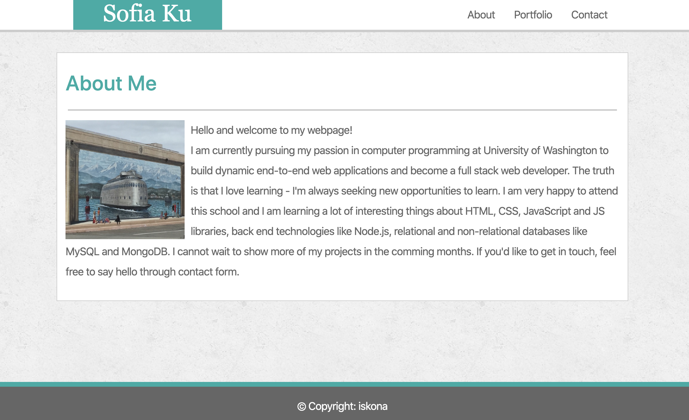
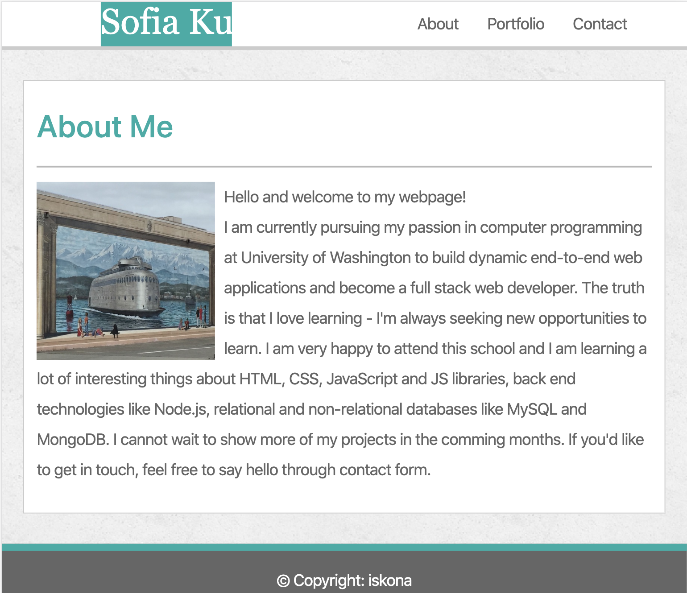
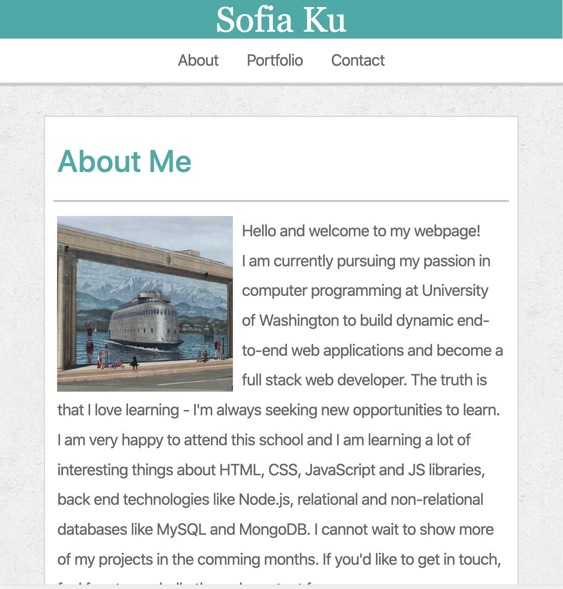
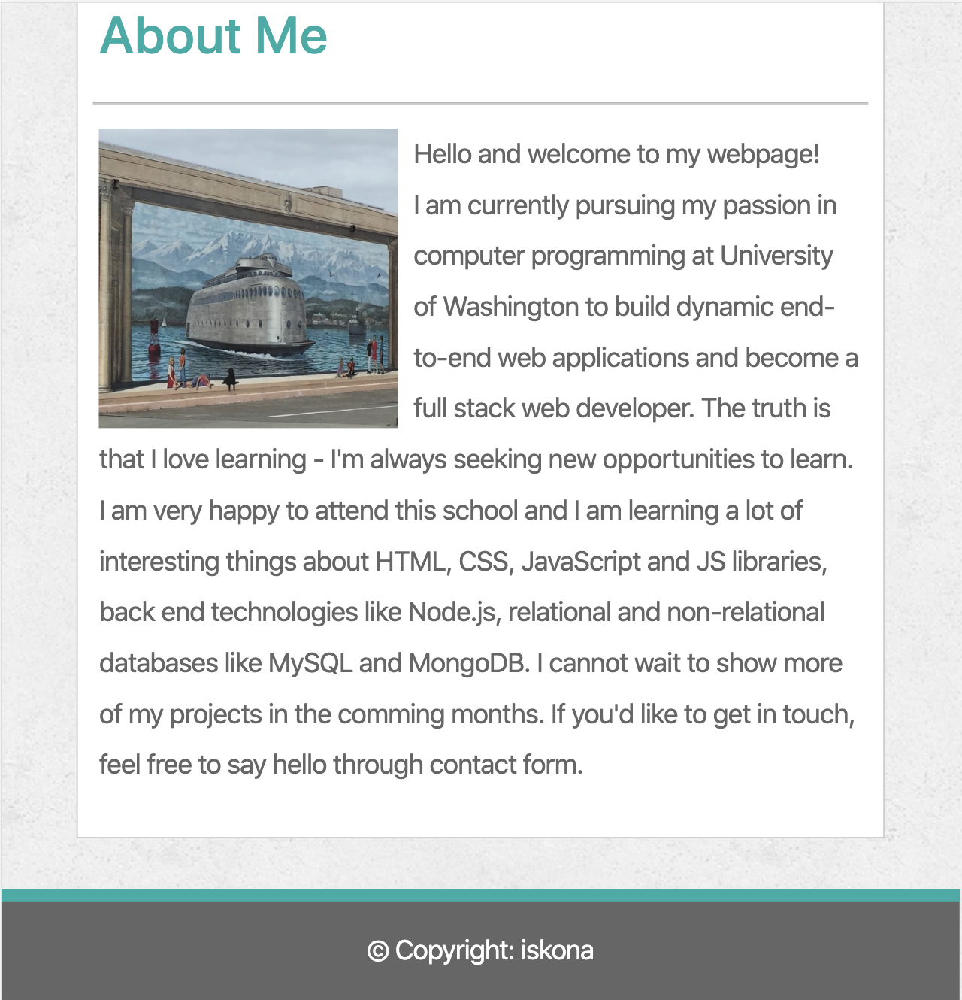

## Overview
Recreation of [Basic Portfolio](https://github.com/iskona/Basic-Portfolio) using Bootstrap CSS Framework and media queries.

[Click here](https://iskona.github.io/Responsive-Portfolio/) to launch this project on GitHub Pages.

## Built with
* HTML
* CSS
* Bootstrap

## Screen sizes supported
* large - `> 980px wide`
* medium - `769px wide`
* small - `640px wide`

## Screenshots
### Large

### Medium

### Small

